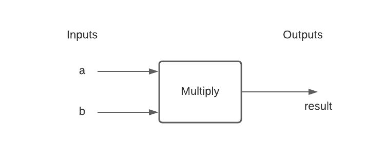

# Functions

A function is a way to bundle and re-run code. It is usefule for code reuse and preventing code duplication. A function has a name, and a block of code. Most functions have inputs and outputs Functions are defined using the `def` keyword and can return a value with the `return` keyword.

    def Multiply(a, b):
        return a * b

The above defines a function called `Multiply` with two parameters 'a' and 'b'.

## Using functions

We've seen many examples of built-in functions within Python: len(), print(), input(), string.lower(), list.append(), etc.

These work the same way as functions we'll eventually define. A function can be **Called** (invoked) by its name, followed by parenthesis. Arguments can be provided inside the parenthesis as needed. For our function `Multiply()` which defines two parameters 'a' and 'b', we can call it like this:

    result = Multiply(5, 7)
    print(result)

In this case we store the return value of the function in a variable called 'result'. Function calls can be assigned and passed just like values. For example:

    print(Multiply(5, 7))

## Arguement versus Parameter

These terms are often used interchangabley but their meaning is distinct. A function **defines** the parameters it accepts. In the above example 'a' and 'b' are parameters.

When we call a function we provide arguments. In the above example, the numbers 5 and 7 are **arguments** provided to the **parameters** 'a' and 'b'.

## Return and Void

Most functions return a value (like our Multiply example). This is done with the `return` keyword. Many functions, such as `print()` do not have a return value, in otherwords they are said to return void, or nothing.
